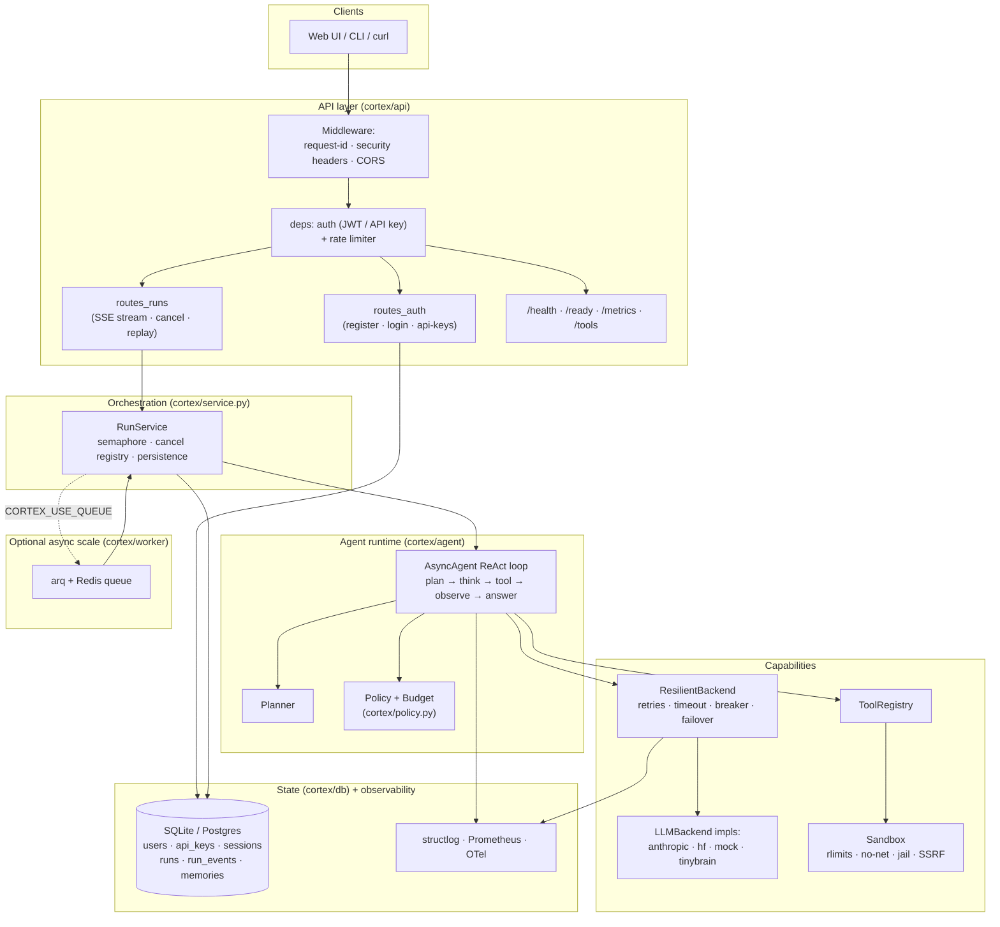
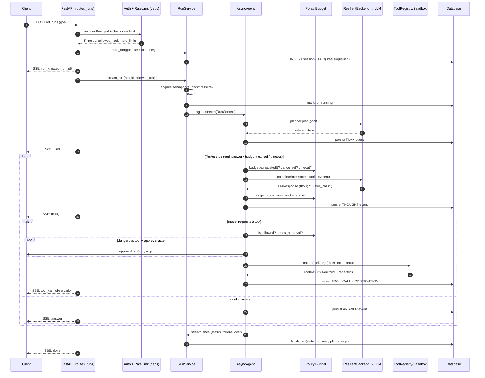
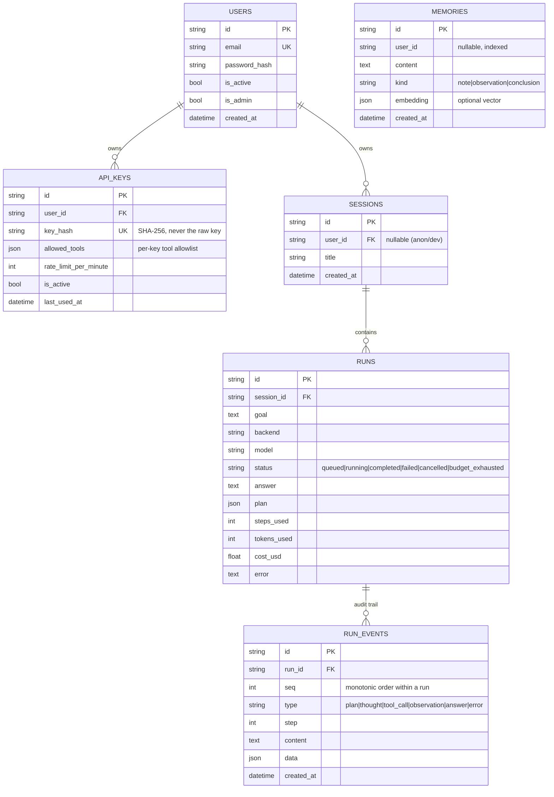

# Architecture

`cortex-agent` is a production-grade, autonomous **agentic AI framework**: a
planning + tool-use + memory ReAct loop wrapped in a hardened async service, a
durable persistence layer, a FastAPI API with SSE streaming, and a pluggable LLM
backend abstraction (including a from-scratch local Transformer LM, *TinyBrain*).

This document explains how the pieces fit together. Every claim here is grounded
in the code under `cortex/`; file references point at the implementation.

---

## 1. High-level overview

The system is layered. Each layer depends only on the layers beneath it:

- **API layer** (`cortex/api/`) — FastAPI app: auth, rate limiting, request
  context, security headers, SSE streaming, health/readiness/metrics, and a web
  UI. Thin; it delegates orchestration downward.
- **Service / orchestration layer** (`cortex/service.py`) — `RunService`: the
  seam between the API and the agent runtime. Owns durable, resumable runs,
  per-process concurrency (backpressure), and cancellation.
- **Agent runtime** (`cortex/agent/`) — the ReAct loop. A sync `Agent`
  (`loop.py`) and a hardened async `AsyncAgent` (`runtime.py`) that emits
  structured `AgentEvent`s and enforces budgets, policy, approval, and timeouts.
- **Capability layer** — pluggable **LLM backends** (`cortex/llm/`) behind the
  `LLMBackend` protocol with a `ResilientBackend` wrapper, and **tools**
  (`cortex/tools/`) behind a sandboxed `ToolRegistry`.
- **State layer** (`cortex/db/`) — SQLAlchemy 2.0 async ORM + Alembic
  migrations: users, API keys, sessions, runs, run events, memories.
- **Cross-cutting** — security primitives (`cortex/security.py`), policy and
  guardrails (`cortex/policy.py`), observability (`cortex/observability.py`),
  configuration (`cortex/config.py`), and an optional arq+redis worker
  (`cortex/worker/`).

A core design principle runs through every layer: **the LLM and all tool/web
output are untrusted**. Tool output is sanitized and wrapped; secrets are
redacted; dangerous tools are gated by policy + approval; hard budgets stop
runaway loops. See [`SECURITY.md`](./SECURITY.md) for the full threat model.

The agent framework and TinyBrain are deliberately decoupled: **the framework
never imports `torch`**. TinyBrain guards every torch import, so the offline CI
path (MockLLM) installs and runs with zero ML dependencies.

---

## 2. Component diagram



---

## 3. The ReAct loop

A run is: **plan → (think → tool_call → observe)\* → answer**.

1. `Planner` (`cortex/agent/planner.py`) decomposes the goal into an ordered
   step list. It is LLM-backed but always degrades to a deterministic heuristic,
   so there is *always* a plan (the MockLLM uses the heuristic directly for
   reproducible demos/tests).
2. The loop calls the backend with the conversation + tool JSON-schemas. The
   model returns a normalized `LLMResponse` — free-form text (its "thought")
   plus zero-or-more `ToolCall`s.
3. Each requested tool is executed by the `ToolRegistry`; the observation is
   appended as a `tool` message (`tool_results`) and optionally written to
   memory.
4. When the model stops requesting tools — or a budget / timeout / cancel
   fires — the loop synthesizes a final answer.

Every meaningful moment is emitted as a structured `AgentEvent`
(`type` ∈ {`plan`, `thought`, `tool_call`, `observation`, `answer`, `error`},
`content`, `step`, `data`, `timestamp`). The CLI, the SSE stream, and the
persistence layer all consume the *same* event stream.

### Sync vs. async agent

- **`Agent`** (`cortex/agent/loop.py`) — the simple synchronous reference loop
  used by the CLI and the `build_agent` one-liner. Bounded by `max_steps`; on
  exhaustion it forces a final synthesis.
- **`AsyncAgent`** (`cortex/agent/runtime.py`) — the production loop. On top of
  ReAct it adds: **budget enforcement** (steps/tokens/USD), a per-run **policy**
  with an optional **human-approval gate** for dangerous tools, **guardrails**
  (untrusted tool output sanitized, secrets redacted), a **resilient backend**
  (retries/timeout/breaker/failover), **per-tool timeouts**, **cancellation +
  wall-clock timeout**, and Prometheus/OTel/structured-log instrumentation. It
  dispatches blocking LLM/tool work to threads (`asyncio.to_thread`) and emits
  the identical `AgentEvent` type — so surfaces and persistence are unchanged.

---

## 4. Request / run lifecycle

A run is created and streamed by `POST /v1/runs`. The API persists every event
as it streams, so a client can reconnect and replay via
`GET /v1/runs/{id}/events`.



Key properties:

- **Durable & resumable.** Every `AgentEvent` is written to `run_events` with a
  monotonic `seq` as it streams (`RunService.stream_run`). A disconnected client
  replays from `GET /v1/runs/{id}/events?after_seq=N`.
- **Backpressure.** `stream_run` runs inside an `asyncio.Semaphore` sized by
  `CORTEX_MAX_CONCURRENT_RUNS`; excess runs wait rather than overload the box.
  (The semaphore is created lazily inside the active event loop for Python 3.9
  correctness.)
- **Cancellable.** `RunService` registers an `asyncio.Event` per in-flight run;
  `POST /v1/runs/{id}/cancel` sets it, and the loop checks it each iteration.
- **Failure is recorded, not lost.** The `finally` block in `stream_run` always
  writes a terminal status (`completed` / `failed` / `cancelled` /
  `budget_exhausted`) plus the final answer and usage.

---

## 5. Module / package layout

```
cortex/
├── __init__.py            # public API + build_agent() convenience factory
├── config.py              # pydantic-settings (CORTEX_ env prefix) + fallback shim
├── security.py            # JWT, API keys, password hashing, secret redaction
├── policy.py              # Policy, Budget, prompt-injection sanitization
├── observability.py       # structlog, Prometheus metrics, OTel spans (all guarded)
├── service.py             # RunService: durable runs, concurrency, cancellation
├── cli.py                 # `cortex` console entrypoint
│
├── agent/
│   ├── loop.py            # sync Agent + AgentEvent/EventType/AgentResult
│   ├── runtime.py         # async AsyncAgent (budget/policy/approval/guardrails)
│   └── planner.py         # goal → ordered steps (LLM + heuristic fallback)
│
├── llm/
│   ├── base.py            # LLMBackend protocol, Message, ToolCall, LLMResponse
│   ├── resilient.py       # ResilientBackend: retries, timeout, breaker, failover
│   ├── cost.py            # per-model price table → Usage + cost_usd
│   ├── mock_backend.py    # deterministic offline backend (CI default)
│   ├── anthropic_backend.py  # Claude (native tool use)
│   └── hf_backend.py      # HuggingFace
│
├── tools/
│   ├── base.py            # Tool, ToolResult, ToolRegistry
│   ├── builtin.py         # calculator, time, read/write_file, run_python, http_get, web_search
│   └── sandbox.py         # jail_path, run_python_sandboxed, assert_safe_url (SSRF)
│
├── db/
│   ├── models.py          # ORM: users, api_keys, sessions, runs, run_events, memories
│   ├── engine.py          # async engine + session_scope (SQLite/Postgres)
│   └── repository.py      # UserRepository, RunRepository, MemoryRepository
│
├── memory/store.py        # legacy keyword/vector memory store (sync Agent path)
│
├── api/
│   ├── server.py          # create_app: middleware, error handlers, ops endpoints, UI
│   ├── deps.py            # Principal, auth dependency, in-process rate limiter
│   ├── middleware.py      # request-id context + security headers
│   ├── routes_auth.py     # register / login / api-keys
│   ├── routes_runs.py     # create+stream run (SSE), cancel, replay, sessions
│   ├── schemas.py         # pydantic request/response models (strict validation)
│   └── web/               # static dark chat UI (index.html, app.js, style.css)
│
├── worker/
│   ├── tasks.py           # arq task execute_run + startup/shutdown + enqueue
│   └── worker_settings.py # arq WorkerSettings entrypoint
│
└── tinybrain/             # from-scratch decoder-only Transformer LM (see README)
    ├── model.py           # RoPE, RMSNorm, causal attention, SwiGLU, weight tying
    ├── tokenizer.py       # BPE (merges via tokenizers); encode/decode are ours
    ├── data.py train.py eval.py generate.py scale_up.py device.py
    └── backend.py         # TinyBrainBackend — serves the LM through LLMBackend
```

Top-level: `Dockerfile`, `docker-compose.yml`, `deploy/` (K8s manifests + Helm
chart), `migrations/` (Alembic), `Makefile`, `pyproject.toml`, `ruff.toml`,
`.pre-commit-config.yaml`, and the requirement sets (`requirements.txt`,
`requirements-min.txt`, `requirements-dev.txt`, `requirements-train.txt`).

---

## 6. The LLM backend abstraction

Every backend implements one method behind a `runtime_checkable` Protocol
(`cortex/llm/base.py`):

```python
class LLMBackend(Protocol):
    name: str
    def complete(self, messages, tools=None, system=None,
                 max_tokens=2048, temperature=0.7) -> LLMResponse: ...
```

The agent loop never special-cases a provider. Backends normalize their wire
format into provider-agnostic types:

- `Message` — `role` ∈ {`user`, `assistant`, `tool`} with `content`,
  `tool_calls`, and `tool_results`.
- `ToolCall` — `id`, `name`, `arguments` (the model's tool request).
- `LLMResponse` — `text`, `tool_calls`, `stop_reason`, `usage`, `model`;
  `.wants_tools` is true when the model requested a tool.

`get_backend(name, model, **kwargs)` constructs by name:

| Backend | Module | Notes |
|---|---|---|
| `mock` | `mock_backend.py` | Deterministic, offline; the CI default and `build_agent` default. |
| `anthropic` | `anthropic_backend.py` | Claude via the Messages API with native `tool_use` blocks. |
| `hf` | `hf_backend.py` | HuggingFace (API or local) via a JSON tool-call protocol. |
| `tinybrain` | `tinybrain/backend.py` | The from-scratch local Transformer; `model` doubles as the checkpoint path. Tool use is best-effort. |

### Resilient failover

`build_resilient_from_settings(settings)` builds a `ResilientBackend`
(`cortex/llm/resilient.py`) from a **primary** (`CORTEX_BACKEND`) plus a
**failover chain** (`CORTEX_FALLBACK_BACKENDS`, default `hf,mock`), always
appending `mock` as a last-resort offline fallback (un-constructable fallbacks,
e.g. a missing SDK, are silently skipped). Each backend call is:

- **timeout-bounded** — run in a `ThreadPoolExecutor` with a per-call timeout
  (`CORTEX_LLM_TIMEOUT_SECONDS`);
- **retried** with exponential backoff (`tenacity` when present, else a built-in
  loop) on `TimeoutError` / `ConnectionError` / `RuntimeError`
  (`CORTEX_LLM_MAX_RETRIES`);
- **guarded by a per-backend circuit breaker** that opens after repeated
  failures and half-opens (one trial call) after a cooldown.

When the primary exhausts retries or its breaker is open, the wrapper fails over
to the next backend in the chain (e.g. `anthropic → hf → mock`), so a run
degrades gracefully instead of failing. If *every* backend fails it raises
`BackendUnavailable`. Token usage from each response is priced via
`cortex/llm/cost.py` (a per-model USD-per-1M table, conservative default for
unknown models) and charged against the run budget and the cost metric.

---

## 7. Data model

Six tables (`cortex/db/models.py`), backend-agnostic (SQLite default, Postgres
via `DATABASE_URL`). `JSON` columns use SQLAlchemy's portable `JSON` type;
embeddings are stored as JSON.



Relationships and lifecycle:

- A **user** owns many **api_keys** and **sessions** (cascade delete).
- A **session** groups many **runs** (history); a session may be anonymous when
  auth is off.
- A **run** owns its **run_events** — the *full audit trail*: every plan,
  thought, tool_call, observation, answer, and error, ordered by `seq`. This is
  what powers SSE replay and post-hoc inspection.
- **memories** are standalone, optionally scoped by `user_id`, recalled by
  keyword (and optionally vector) for context injection on future runs.

Access goes through repositories (`cortex/db/repository.py`):
`UserRepository`, `RunRepository`, `MemoryRepository`. The async engine and the
`session_scope()` context manager live in `cortex/db/engine.py`. `create_all`
bootstraps the schema for SQLite/dev; **production runs Alembic migrations**
(`migrations/`).

---

## 8. Tool system & sandbox

A `Tool` (`cortex/tools/base.py`) bundles a `name`, `description`, a JSON-schema
`parameters` block, `required` fields, a `func` callable, and a `dangerous`
flag. `to_schema()` renders it into Anthropic's tool-definition format, so the
same tool list feeds any backend. The `ToolRegistry` holds tools by name and
exposes `to_schemas()` and `execute(name, args)`; `Tool.run` coerces any return
into a `ToolResult(output, is_error, data)` and never lets a tool raise into the
loop.

`build_default_registry(workspace, …)` (`cortex/tools/builtin.py`) wires the
built-in tools, sandboxed to a workspace:

| Tool | Dangerous | Hardening |
|---|---|---|
| `calculator` | no | AST evaluation (no `eval`); exponent magnitude capped. |
| `current_time` | no | Pure, read-only. |
| `read_file` | no | Jailed to the workspace (`jail_path`). |
| `write_file` | **yes** | Jailed; `..` traversal **and** symlink escape blocked. |
| `run_python` | **yes** | Isolated subprocess sandbox (see below). |
| `http_get` | **yes** | SSRF guard; omitted entirely when `enable_network=False`. |
| `web_search` | no | Pluggable; local-fixture fallback when offline. |

The security-critical primitives are concentrated in `cortex/tools/sandbox.py`
(unit-tested in isolation by `tests/test_sandbox.py`):

- **`jail_path(workspace, rel_path)`** — resolves a model-supplied path strictly
  inside the workspace using `os.path.realpath` (fully resolving symlink
  components, even in not-yet-existing prefixes), rejecting absolute paths, `..`
  traversal, and symlinks that point outside the jail.
- **`run_python_sandboxed(code, …)`** — runs code in a separate
  `python -I -B` subprocess with: CPU/memory/file-size/process **rlimits** via a
  POSIX `preexec_fn`; a **wall-clock timeout** that kills the process group; an
  **import allowlist** (`DEFAULT_ALLOWED_MODULES`) plus disabled networking
  injected before user code; a fresh **temp working directory**; and a **minimal
  environment** (no inherited API keys / PATH).
- **`assert_safe_url(url)`** — SSRF guard: an `http`/`https` scheme allowlist
  plus DNS resolution that rejects private, loopback, link-local, multicast,
  reserved, or unspecified addresses. `http_get` additionally refuses to follow
  redirects (a 3xx can't bounce past the initial check) and caps response size
  and time.

See [`SECURITY.md`](./SECURITY.md) for the exact sandbox guarantees and limits.

---

## 9. Policy, budget & guardrails

`cortex/policy.py` decouples "what a run may do" from the loop so it is
unit-testable and reusable by the worker.

- **`Policy`** governs per-run permissions:
  - `is_allowed(tool)` — a per-key tool allowlist (`None` ⇒ all registered tools
    allowed). The allowlist flows from the API key's `allowed_tools` column
    through `Principal` into `Policy.from_settings`.
  - `needs_approval(tool)` — when `require_approval` is on and the tool is in
    `DANGEROUS_TOOLS` (`write_file`, `run_python`, `http_get`), the call must be
    approved. `AsyncAgent` invokes an optional `approval_cb`; a denial returns a
    blocking observation instead of executing.
- **`Budget`** — hard, live-counted limits on **steps**, **total tokens**, and
  **USD cost**. `AsyncAgent` calls `budget.exhausted()` each iteration; when any
  limit trips, the loop stops and the agent is asked for one final best-effort
  answer (`status=budget_exhausted`). This is the primary defense against
  infinite loops and runaway cost.
- **Prompt-injection mitigation** — `sanitize_tool_output(text, source)` wraps
  every successful tool/web observation in explicit *untrusted-content* markers,
  truncates it, and flags text that resembles injected instructions ("ignore
  previous instructions", "reveal the system prompt", …). The system prompt also
  tells the model to treat tool/web output as **data, never instructions**.

On top of policy, `AsyncAgent` applies a **per-tool timeout**, a whole-run
**wall-clock timeout**, **cancellation** checks, and **secret redaction**
(`redact_secrets` / `redact_mapping` from `cortex/security.py`) on tool
arguments and observations before they are emitted or persisted.

---

## 10. Observability

`cortex/observability.py` provides three guarded subsystems (each a no-op when
its optional dependency is absent):

- **Structured logging** — `structlog` JSON logs (stdlib fallback). `bind_context`
  binds `run_id` (in the runtime) and `request_id` (in middleware) so every log
  line in a request/run is correlated.
- **Prometheus metrics** — exposed at `GET /metrics`:
  `cortex_runs_total{status}`, `cortex_agent_steps`,
  `cortex_tool_calls_total{tool,status}`, `cortex_tool_latency_seconds{tool}`,
  `cortex_llm_tokens_total{provider,direction}`,
  `cortex_llm_cost_usd_total{provider}`, `cortex_run_duration_seconds`, and
  `cortex_errors_total{component}`.
- **OpenTelemetry spans** — `span("agent.step")` / `span("tool.call")` wrap the
  hot paths when `CORTEX_ENABLE_TRACING=true` and the OTel package is installed.

`GET /health` is liveness, `GET /ready` checks the database (`SELECT 1`), and
`GET /tools` lists registered tools + schemas.

---

## 11. Concurrency & queue model

Two execution modes, selected by `CORTEX_USE_QUEUE`:

- **Inline (default).** `POST /v1/runs` drives the run in the request coroutine
  via `RunService.stream_run`, streaming SSE directly. A per-process
  `asyncio.Semaphore` (`CORTEX_MAX_CONCURRENT_RUNS`) provides backpressure. LLM
  calls and tool execution are dispatched to threads (`asyncio.to_thread`) so the
  event loop stays responsive while blocking SDK / subprocess work runs.
- **Queued.** With `CORTEX_USE_QUEUE=true`, runs are enqueued on an **arq +
  Redis** queue (`cortex/worker/`) and executed by a separate **worker** process
  (`run_to_completion`). Events still stream into the database, so clients tail
  progress via `GET /v1/runs/{id}/events`. The API and workers scale
  independently; `docker-compose.yml` and the Helm chart wire `api` + `worker` +
  `redis` + `postgres`.

Both modes share the same `RunService`, persistence, policy, and runtime — the
queue is purely a placement decision.

---

## 12. Configuration

All configuration is via `pydantic-settings` with the `CORTEX_` env prefix and
an optional `.env` file (`cortex/config.py`). A fallback shim backed by
`os.environ` keeps the module importable when `pydantic-settings` is absent.
Selected knobs:

| Area | Settings (env: `CORTEX_…`) |
|---|---|
| LLM / agent | `BACKEND`, `MODEL`, `FALLBACK_BACKENDS`, `MAX_STEPS`, `MAX_TOKENS`, `TEMPERATURE`, `RUN_TIMEOUT_SECONDS`, `LLM_TIMEOUT_SECONDS`, `LLM_MAX_RETRIES` |
| Budgets | `MAX_TOTAL_TOKENS`, `MAX_COST_USD` |
| Tools / sandbox | `WORKSPACE`, `ENABLE_NETWORK_TOOLS`, `TOOL_TIMEOUT_SECONDS`, `PYTHON_CPU_SECONDS`, `PYTHON_MEMORY_MB`, `PYTHON_WALL_SECONDS`, `REQUIRE_APPROVAL`, `HTTP_MAX_BYTES` |
| State | `DATABASE_URL`, `SYNC_DATABASE_URL`, `USE_VECTORS` |
| Queue / scale | `REDIS_URL`, `USE_QUEUE`, `MAX_CONCURRENT_RUNS` |
| Security | `JWT_SECRET`, `JWT_ALGORITHM`, `JWT_EXPIRE_MINUTES`, `AUTH_REQUIRED`, `CORS_ORIGINS`, `RATE_LIMIT_PER_MINUTE`, `MAX_GOAL_LENGTH` |
| Server / observability | `HOST`, `PORT`, `LOG_LEVEL`, `LOG_JSON`, `ENABLE_METRICS`, `ENABLE_TRACING` |

**Provider API keys are never in `Settings`.** They live in their conventional
env vars (`ANTHROPIC_API_KEY`, `HF_TOKEN`) and are read by the backends directly,
so they are never hardcoded or logged.

---

## 13. How it scales

- **Horizontally.** The API is stateless apart from the shared database; run
  multiple replicas behind a load balancer. State (runs, events, sessions,
  memories) lives in Postgres via `DATABASE_URL`.
- **Decoupled execution.** Enable the queue to move long runs off the request
  path and scale workers independently of API replicas (HPA-friendly; a Helm
  `hpa.yaml` is provided).
- **Backpressure & limits.** The per-process semaphore, per-tool and per-run
  timeouts, and hard per-run budgets bound resource usage under load.
- **Graceful degradation.** The resilient backend keeps runs alive through
  provider outages via retries, the circuit breaker, and failover to `mock`.
- **Portability.** Python 3.9+ core with optional dependencies import-guarded
  (`torch`, `structlog`, `prometheus_client`, `tenacity`, `arq`, OTel), so the
  framework runs in minimal environments and the CI path needs no ML stack,
  Redis, or API keys. The Docker image targets 3.11, multi-stage, non-root, with
  a `HEALTHCHECK`.

---

## 14. TinyBrain — the from-scratch local brain

`cortex/tinybrain/` is a complete, from-scratch decoder-only Transformer LM
(RoPE, RMSNorm, multi-head causal attention, SwiGLU MLP, weight tying) with its
own BPE tokenizer, a TinyShakespeare data pipeline, training/eval/generation
scripts, and a `TinyBrainBackend` that serves it through the *same* `LLMBackend`
protocol — so `--backend tinybrain` plugs a model you trained into the identical
agent loop, CLI, and API.

It is honestly positioned as a **zero-dependency local demo brain**, not a
production model: a 4.7M-parameter model trained 2000 steps on CPU reached a best
validation loss of ~4.06 / perplexity ~57.9 (held-out eval confirmed 57.59). It
learns the *style* of the corpus and tool-calling is best-effort. For real
agentic work, use the `anthropic` or `hf` backends. See
[`cortex/tinybrain/README.md`](./cortex/tinybrain/README.md) for training
commands, metrics, and the GPU scale-up path.

---

## Related docs

- [`SECURITY.md`](./SECURITY.md) — threat model, sandbox guarantees, hardening
  checklist, and vulnerability reporting.
- [`CONTRIBUTING.md`](./CONTRIBUTING.md) — dev setup, quality gates, and how to
  extend tools / backends / migrations.
- [`cortex/tinybrain/README.md`](./cortex/tinybrain/README.md) — the
  from-scratch local Transformer LM.
</content>
