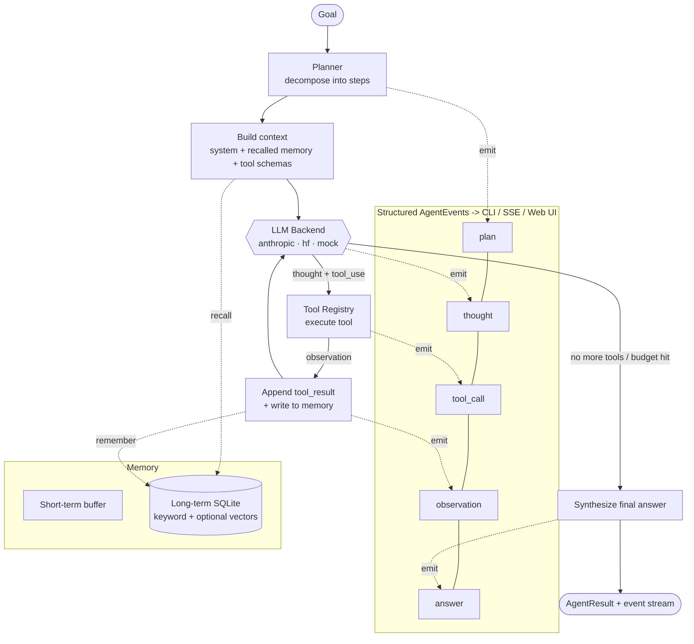

<div align="center">

# ◆ cortex-agent

**A single, powerful autonomous agent — planning, tool use, memory, and a ReAct loop.**

[](https://github.com/OCT0PUSPR/cortex-agent/actions/workflows/ci.yml)
[](LICENSE)
[](https://www.python.org/)
[](#-llm-backends)
[](#-the-mockllm-backend)

</div>

---

`cortex-agent` is a clean, runnable, open-source **autonomous agentic AI framework**. It gives
you one capable agent that **plans** a goal into steps, **reasons** about what to do, **calls
tools**, **observes** the results, and **remembers** across runs — all streamed as structured
events you can render in a terminal or the web UI.

It ships with three interchangeable LLM backends behind one protocol: **Anthropic Claude**
(native tool use), **HuggingFace** (Inference API or local `transformers`), and a deterministic
**MockLLM** so the entire agent loop — and the test suite — runs **end to end with no API key and
no network**.

```bash
# No key, no network — the full loop runs on the MockLLM:
cortex run "Calculate 21 * 2 and tell me the current time"
```

## ✨ Features

- **ReAct / plan-execute loop** — think → choose tool → observe → repeat, with a max-steps budget
  and a planner that decomposes goals into a task list.
- **Real, safe tools** — calculator (AST eval, no `eval`), sandboxed `read_file`/`write_file`,
  `run_python` (subprocess + timeout in a temp sandbox), `http_get`, `current_time`, and a
  pluggable `web_search` with an offline fixture fallback.
- **Pluggable LLM backends** — Anthropic (native `tools` + `tool_use`/`tool_result` blocks),
  HuggingFace (API or local), and an offline **MockLLM** that drives a believable multi-step
  trajectory.
- **Memory** — a short-term conversation buffer plus long-term SQLite storage with **keyword
  recall** and **optional vector recall** (`sentence-transformers`, guarded; falls back to keyword).
- **Structured event stream** — every thought, tool call, observation, and answer is an
  `AgentEvent`, so UIs can stream the agent's reasoning live.
- **Three surfaces** — a `rich` CLI, a FastAPI server with **SSE streaming**, and a clean dark
  **web UI** that shows the plan and a live step timeline.
- **Authoring-friendly** — add a tool in ~10 lines; configure with env vars / `.env`.
- **Batteries included** — Dockerfile, docker-compose, pytest suite, and CI that passes offline.

## 🧠 Architecture: the agent loop



## 🚀 Quickstart

```bash
# 1. Clone and enter
git clone https://github.com/OCT0PUSPR/cortex-agent.git
cd cortex-agent

# 2. (Recommended) create a virtualenv
python3 -m venv .venv && source .venv/bin/activate

# 3. Install
pip install -e .
#   ...or just the deps:  pip install -r requirements.txt

# 4. Run the agent — works immediately on the offline MockLLM
cortex run "Search for cortex-agent and summarize it"
```

> The **MockLLM** backend is the default, so the command above needs **no API key and no network**.
> To use a real model, set `--backend anthropic` (and `ANTHROPIC_API_KEY`) or `--backend hf`.

### Use a real model

```bash
cp .env.example .env          # then edit .env
export ANTHROPIC_API_KEY=sk-ant-...      # or put it in .env

cortex --backend anthropic --model claude-sonnet-4-6 run "Plan a 3-step launch checklist"
cortex --backend hf --model Qwen/Qwen2.5-7B-Instruct run "What is a ReAct agent?"
```

## 🛠 Usage

### CLI

```bash
cortex run "<goal>"           # run once, streaming reasoning to the terminal
cortex chat                   # interactive REPL with persistent memory
cortex tools                  # list registered tools

# Flags (global): --backend mock|anthropic|hf  --model <id>  --max-steps <n>
cortex --backend mock --max-steps 6 run "Write a file plan.txt then read it back"
```

### Web UI + API server

```bash
# Start the FastAPI server (serves the web UI at http://127.0.0.1:8000)
uvicorn cortex.api.server:app --reload
#   ...or: python -m cortex.api.server
```

Open **http://127.0.0.1:8000** and give the agent a goal — the plan, thoughts, tool calls,
observations, and final answer stream in live over Server-Sent Events, with a step timeline.

API endpoints:

| Method | Path      | Description                                              |
| ------ | --------- | ------------------------------------------------------- |
| `GET`  | `/`       | Dark chat-style web UI                                   |
| `GET`  | `/health` | Health probe                                            |
| `GET`  | `/tools`  | List registered tools + JSON schemas                    |
| `POST` | `/run`    | Run a goal; **streams `AgentEvent`s as SSE**            |

```bash
# Stream a run over SSE from the command line:
curl -N -X POST http://127.0.0.1:8000/run \
  -H "Content-Type: application/json" \
  -d '{"goal": "Calculate 21 * 2", "backend": "mock", "max_steps": 6}'
```

### Python API

```python
from cortex import build_agent

# One-liner: fully wired agent (tools + memory) on the offline backend.
agent = build_agent(backend="mock")            # or backend="anthropic"
result = agent.run("Calculate 21 * 2 and tell me the current time")

print(result.answer)
print("plan:", result.plan.steps)
print("steps used:", result.steps_used)

# Or stream the structured events as they happen:
for event in agent.stream("Search for cortex-agent"):
    print(event.type.value, "->", event.content)
```

Compose the pieces yourself for full control:

```python
from cortex.agent import Agent
from cortex.llm import get_backend
from cortex.memory import Memory
from cortex.tools import build_default_registry

agent = Agent(
    backend=get_backend("anthropic", model="claude-opus-4-8"),
    registry=build_default_registry(workspace="./.cortex/workspace"),
    memory=Memory.create(db_path="./.cortex/memory.sqlite"),
    max_steps=8,
)
print(agent.run("Summarize what tools you have.").answer)
```

## 🧩 Tool-authoring guide

A tool is a name, a description (the model reads this to decide *when* to use it), a JSON-schema
for its parameters, and a `run` callable. Adding one is ~10 lines:

```python
from cortex.tools import Tool, build_default_registry

def reverse_text(text: str) -> str:
    """Return the input string reversed."""
    return text[::-1]

registry = build_default_registry()
registry.register(
    Tool(
        name="reverse_text",
        description="Reverse a string. Use when the user asks to reverse text.",
        parameters={"text": {"type": "string", "description": "Text to reverse."}},
        required=["text"],
        func=reverse_text,
    )
)
```

Your `func` may return a plain value (coerced to a `ToolResult`) or an explicit
`cortex.tools.ToolResult(output=..., is_error=..., data=...)` for richer control. The registry
renders every tool into Anthropic's native tool format automatically — Claude calls them via
`tool_use` blocks; open models call them via a JSON protocol the HF backend parses. Pass the
registry to an `Agent` and the new tool is immediately available.

**Safety notes:** file tools are sandboxed to the workspace dir (path traversal is rejected);
`run_python` executes in an isolated subprocess with a wall-clock timeout; the calculator parses
an AST and never uses `eval`.

## ⚙️ Configuration

Configuration comes from environment variables (prefix `CORTEX_`) and an optional `.env`
(via `pydantic-settings`). Copy `.env.example` to `.env`. **API keys are read from their standard
env vars and are never hardcoded.**

| Variable                      | Default                  | Description                                    |
| ----------------------------- | ------------------------ | ---------------------------------------------- |
| `ANTHROPIC_API_KEY`           | —                        | Claude API key (read by the Anthropic backend) |
| `HF_TOKEN`                    | —                        | HuggingFace token (read by the HF backend)     |
| `CORTEX_BACKEND`              | `mock`                   | `mock`, `anthropic`, or `hf`                    |
| `CORTEX_MODEL`                | backend default          | Model id override                              |
| `CORTEX_MAX_STEPS`            | `8`                      | Max ReAct steps per run                        |
| `CORTEX_MAX_TOKENS`           | `2048`                   | Max output tokens per LLM call                 |
| `CORTEX_TEMPERATURE`          | `0.7`                    | Sampling temperature                           |
| `CORTEX_WORKSPACE`            | `.cortex/workspace`      | Sandbox dir for file/python tools              |
| `CORTEX_MEMORY_DB`            | `.cortex/memory.sqlite`  | SQLite path for long-term memory               |
| `CORTEX_USE_VECTORS`          | `false`                  | Enable vector recall (if deps installed)       |
| `CORTEX_ENABLE_NETWORK_TOOLS` | `true`                   | Expose `http_get` to the agent                 |
| `CORTEX_HOST` / `CORTEX_PORT` | `127.0.0.1` / `8000`     | API server bind address                        |

### Model IDs (Anthropic)

`claude-opus-4-8` (most capable) · `claude-sonnet-4-6` (balanced default) · `claude-haiku-4-5`
(fast/cheap). HuggingFace examples: `Qwen/Qwen2.5-7B-Instruct`, `meta-llama/Llama-3.1-8B-Instruct`.

## 🤖 LLM backends

All three implement the same `LLMBackend` protocol (`complete(messages, tools) -> LLMResponse`)
with a normalized tool-call representation, so they are fully interchangeable.

| Backend     | How tool use works                                        | Needs a key? |
| ----------- | --------------------------------------------------------- | ------------ |
| `anthropic` | Native Anthropic `tools` + `tool_use`/`tool_result` blocks | `ANTHROPIC_API_KEY` |
| `hf`        | JSON tool-call protocol via Inference API or local `transformers` | `HF_TOKEN` (API mode) |
| `mock`      | Scripted, deterministic trajectory                        | **No** |

### The MockLLM backend

The `MockLLM` inspects the conversation and drives a believable, reproducible multi-step run: it
emits a thought, picks a tool relevant to the goal (calculator, time, file, search…), and after
seeing the observation either chains a second tool or synthesizes a final answer that quotes the
result. This is what makes the demo, the web UI, and the **entire test suite** run offline.

## 🧬 TinyBrain — a from-scratch Transformer LM

`cortex/tinybrain/` is a **decoder-only Transformer language model implemented from scratch**
in PyTorch — no `transformers`, no nanoGPT copy. Every component is written in this repo:

- **token + RoPE positional embeddings** (rotary embeddings implemented here),
- **multi-head causal self-attention** (PyTorch SDPA, hand-written masked fallback),
- **RMSNorm**, **SwiGLU MLP**, pre-norm residual blocks, **weight tying**,
- a **byte-level BPE tokenizer** (merge-learning via the `tokenizers` lib; encode/decode wiring ours),
- a real **training pipeline**: AdamW, cosine LR + linear warmup, grad clip, periodic eval,
  **resumable** checkpointing, device auto-select (**MPS > CUDA > CPU**),
- **eval** (held-out perplexity), **generation** (top-k + temperature), and a
  **`TinyBrainBackend`** that serves the model you trained through the same `LLMBackend` protocol.

`torch` is import-guarded: importing `cortex` never requires it, so the MockLLM CI path stays
torch-free. ML deps live in `requirements-train.txt`.

### Train it (≈10 min on an Apple-Silicon MPS GPU)

This is the exact command that produced the metrics below:

```bash
pip install -r requirements-train.txt          # torch, numpy, tokenizers, httpx
python -m cortex.tinybrain.train \
    --n-layer 4 --n-head 8 --n-embd 256 --vocab-size 4096 \
    --block-size 256 --batch-size 40 --dropout 0.15 \
    --max-steps 1500 --lr 4e-4 --eval-interval 150 --device mps
# checkpoints + tokenizer + train_log.json land in .cortex/tinybrain/
# (best.pt/last.pt are resumable; model.pt is the slim, inference-only export)
```

Then evaluate held-out perplexity and generate:

```bash
python -m cortex.tinybrain.eval     --checkpoint .cortex/tinybrain
python -m cortex.tinybrain.generate --checkpoint .cortex/tinybrain --prompt "ROMEO:" --max-new-tokens 240
```

### Real results

These are **real, measured numbers** from an actual training run on an Apple M-series
**MPS** GPU — a **5.25M-parameter** model (L=4, H=8, D=256, vocab 4096, block 256) on the full
**TinyShakespeare** corpus (308K train / 34K val BPE tokens), in **well under 10 minutes**
(comfortably inside the 45-minute budget). The slim inference checkpoint exported from the best
step is **~21 MB** (`model.pt`) — a committable proof artifact under 25 MB.

**Held-out evaluation (`cortex.tinybrain.eval`, 300 batches on the val split):**

| metric | value |
| ------ | ----- |
| validation loss (cross-entropy / BPE token) | **4.420** |
| validation perplexity | **83.1** |

**Training curve (real log — the tiny corpus overfits, so the best checkpoint is saved at the
validation minimum, step 450, and exported to the slim `model.pt`):**

```
[tinybrain] device = mps
[tinybrain] train tokens=307711 val tokens=34191
[tinybrain] model params = 5.25M (L=4 H=8 D=256)
step   0 | train 8.3043 | val 8.2861 | ppl 3968.22     # random init (≈ln(vocab))
step 150 | train 4.9806 | val 5.0639 | ppl 158.21
step 300 | train 4.2287 | val 4.5690 | ppl  96.45
step 450 | train 3.8458 | val 4.4313 | ppl  84.04   <-- best val (checkpointed -> model.pt)
step 600 | train 3.5479 | val 4.4544 | ppl  86.00
step 750 | train 3.3291 | val 4.6525 | ppl 104.84      # overfitting begins
```

**Real generated samples** (`cortex --backend tinybrain`, temp 0.8, top-k 40 — verbatim output
from the committed checkpoint, no cherry-picking):

```
ROMEO:                                          To be, or not to be a purse to be,
I will not, my father.                          The man's dead, is it not: but that he is,
                                                As is as much.
LADY ANNE:
What's the good fair queen?                     LEONTES:
                                                We are, my lord,
QUEEN MARGARET:                                 And here it could not be not a word of it.
'Tis a man man; and that he is not in thine.
                                                CAMILLO:
KING RICHARD II:                                Hail, that's not to have done to have you...
I think it is, I cannot come.
```

From a random init, the model learned character names (ROMEO, QUEEN MARGARET, KING RICHARD,
LEONTES, CAMILLO…), the play's dialogue layout, capitalization, and period vocabulary —
entirely from scratch, exactly what a working decoder-only LM should pick up at this scale.

> Reproducibility note: results are seeded (`seed=1337`) but small run-to-run variation on MPS is
> normal. Re-running the training command above reproduces a model in the same ppl ≈ 83–90 range.

### Serve it as an agent backend

The trained model plugs into the agent loop, CLI, and API like any other backend:

```bash
# Point --model at the checkpoint dir (or a .pt file); defaults to .cortex/tinybrain
cortex --backend tinybrain run "To be, or not to be"
```

```python
from cortex.llm import get_backend
from cortex.llm.base import Message

brain = get_backend("tinybrain", model=".cortex/tinybrain")
print(brain.complete([Message(role="user", content="ROMEO:")]).text)   # one-shot
for chunk in brain.stream([Message(role="user", content="ROMEO:")]):    # token-by-token
    print(chunk, end="")
```

> **Honest positioning:** TinyBrain is a **zero-dependency local demo brain**, not a production
> model. A few-million-parameter model trained on TinyShakespeare for a few minutes cannot reliably
> emit structured tool calls, so native tool-use is *best-effort* (the backend parses a
> `{"tool": …}` block if the model happens to produce one). Use **Anthropic/HF for real agentic
> tool use**, and TinyBrain to prove the from-scratch model wires cleanly into the framework.

### Scale up on a GPU (Colab / cloud)

The exact same code path scales — only the hyperparameters change:

```bash
# Single modern GPU (A100/4090). Use a larger corpus via --corpus-url or a corpus.txt.
python -m cortex.tinybrain.scale_up \
    --out-dir runs/big --max-steps 50000 --batch-size 64 \
    --n-layer 12 --n-head 12 --n-embd 768 --block-size 512 \
    --vocab-size 16384 --lr 6e-4 --compile
```

On Colab: `!pip install -r requirements-train.txt`, set the runtime to a GPU, then run the
command above (drop `--compile` if your torch build lacks it). Checkpoints are resumable with
`--resume`, so you can train across sessions.

## 🐳 Docker

```bash
# Build + run the API/web UI (offline MockLLM by default)
docker compose up --build
# -> open http://127.0.0.1:8000

# Run the CLI in the container
docker run --rm cortex-agent cortex run "Calculate 21 * 2"

# Use a real backend by passing the key through
docker run --rm -e ANTHROPIC_API_KEY=sk-ant-... cortex-agent \
  cortex --backend anthropic run "Plan my day"
```

## 🧪 Tests & quality gates

The suite covers the tool registry and sandbox, memory, the LLM layer, the
policy/budget/security primitives, the async runtime, the SQLAlchemy persistence
layer, the FastAPI surface, the resilient backend, and the from-scratch TinyBrain
model — all on the MockLLM with **no network and no API key**. The TinyBrain
tests are torch-gated and skip cleanly when torch is absent.

```bash
pip install -r requirements.txt -r requirements-dev.txt

pytest -q --cov=cortex --cov-report=term-missing --cov-fail-under=80   # tests + coverage
ruff check cortex tests                                                # lint
mypy cortex                                                            # types
bandit -c pyproject.toml -r cortex                                     # security
CORTEX_SYNC_DATABASE_URL=sqlite:///./tmp.db alembic upgrade head       # migrations
```

CI runs all of the above on Python 3.9/3.11/3.12 (offline, MockLLM, torch-free).
See [`ARCHITECTURE.md`](ARCHITECTURE.md) and [`SECURITY.md`](SECURITY.md) for the
system design and the agent-sandbox guarantees.

## 📁 Project tree

```
cortex-agent/
├── cortex/
│   ├── __init__.py            # build_agent() + public API
│   ├── config.py              # pydantic-settings (with stdlib fallback)
│   ├── cli.py                 # rich CLI: run / chat / tools  (--backend tinybrain)
│   ├── policy.py              # Policy/Budget + prompt-injection sanitization
│   ├── security.py            # JWT, API keys, password hashing, secret redaction
│   ├── observability.py       # structlog + Prometheus metrics + OTel spans
│   ├── service.py             # RunService: durable, resumable, persisted runs
│   ├── llm/
│   │   ├── base.py            # LLMBackend protocol + normalized types
│   │   ├── anthropic_backend.py / hf_backend.py / mock_backend.py
│   │   ├── resilient.py       # retries + timeout + circuit breaker + failover
│   │   └── cost.py            # per-model token-cost accounting
│   ├── tools/
│   │   ├── base.py            # Tool + ToolRegistry
│   │   ├── builtin.py         # calculator, files, run_python, http_get, ...
│   │   └── sandbox.py         # path jail, subprocess rlimits, SSRF guard
│   ├── agent/
│   │   ├── loop.py            # the sync Agent + ReAct loop + AgentEvents
│   │   ├── runtime.py         # AsyncAgent: budgets, policy, guardrails, cancel
│   │   └── planner.py         # goal -> task list
│   ├── memory/store.py        # short-term buffer + SQLite long-term recall
│   ├── db/                    # SQLAlchemy 2.0 async models + repositories
│   ├── api/                   # FastAPI: SSE runs, auth, metrics, web UI
│   ├── worker/                # arq Redis queue worker (optional)
│   └── tinybrain/             # ⭐ from-scratch Transformer LM (RoPE/RMSNorm/SwiGLU)
│       ├── model.py  tokenizer.py  data.py  device.py
│       ├── train.py  eval.py  generate.py  scale_up.py
│       └── backend.py         # TinyBrainBackend (LLMBackend: complete + stream)
├── migrations/                # Alembic (initial schema migration included)
├── tests/                     # pytest: ~175 tests, ≥80% coverage on core
├── ARCHITECTURE.md  SECURITY.md
├── .github/workflows/ci.yml   # ruff + mypy + bandit + pytest/cov + alembic
├── requirements.txt           # runtime deps (agent + hardening layer)
├── requirements-dev.txt       # test/lint/type/security toolchain
├── requirements-train.txt     # torch + tokenizers (TinyBrain only)
├── requirements-min.txt       # minimal offline deps
├── pyproject.toml             # packaging + ruff/mypy/bandit/coverage config
├── Dockerfile / docker-compose.yml
├── .env.example
└── LICENSE
```

## 🗺 Roadmap

- [ ] Streaming token-level output from the Anthropic backend into the event stream.
- [ ] Parallel tool execution within a single step.
- [ ] Pluggable real web-search providers (Tavily, SerpAPI, Brave).
- [ ] Reflection / self-critique step before finalizing an answer.
- [ ] Persisted, resumable sessions and a conversation history viewer in the web UI.
- [ ] A `cortex serve` CLI subcommand and richer per-tool permission policies.
- [ ] More backends (OpenAI-compatible local servers, Ollama) behind the same protocol.

## 📄 License

[MIT](LICENSE) © 2026 OCT0PUSPR
